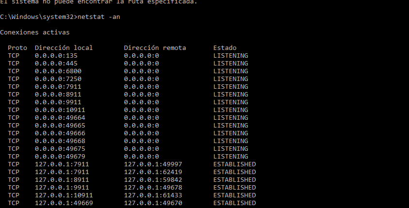
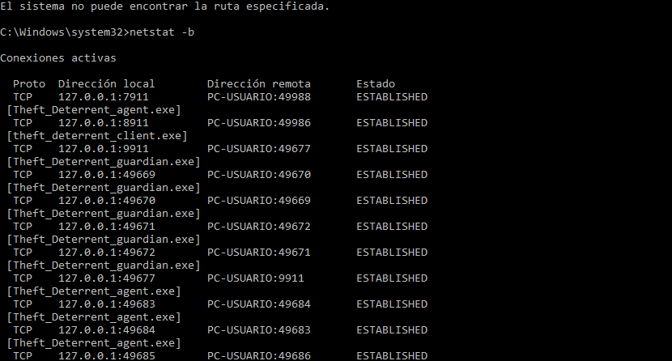
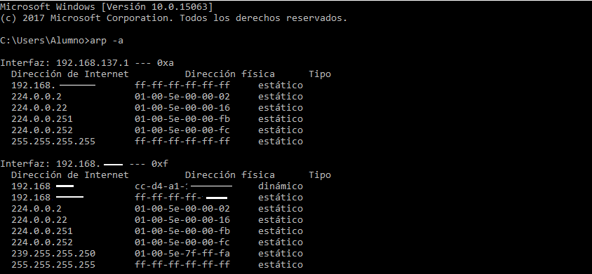
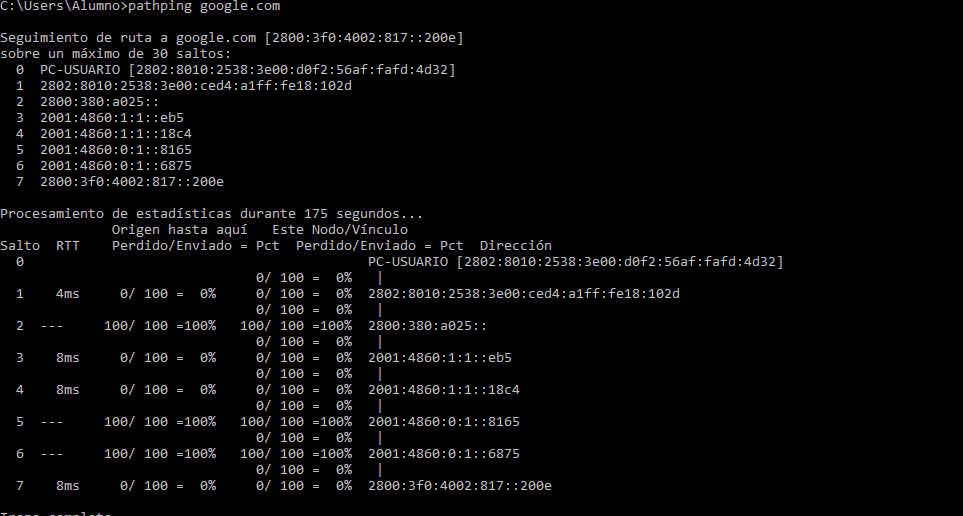

# 🖥️ Día 3 — Comandos de diagnóstico de red en CMD

Práctica real de comandos avanzados ejecutados en Windows.
Todos los outputs son de ejecución propia.

---

## 📋 Comandos practicados hoy

| Comando | Para qué sirve |
|---------|---------------|
| `netstat -an` | Ver todas las conexiones activas |
| `netstat -b` | Ver qué proceso usa cada conexión |
| `nslookup` | Diagnosticar problemas de DNS |

---

## 1. netstat -an

**¿Para qué sirve?**
Muestra todas las conexiones de red activas en el equipo
con IPs numéricas. Útil para ver qué puertos están 
escuchando y detectar conexiones sospechosas.

**Requiere:** CMD normal (sin administrador)



**Las 4 columnas:**
- **Proto** → protocolo usado, TCP o UDP
- **Dirección local** → tu equipo y puerto
- **Dirección remota** → servidor destino y puerto
- **Estado** → situación de la conexión

**Estados importantes:**

| Estado | Significado |
|--------|------------|
| LISTENING | Puerto abierto esperando conexiones |
| ESTABLISHED | Conexión activa ahora mismo |
| TIME_WAIT | Conexión cerrándose ordenadamente |
| CLOSE_WAIT | El servidor cerró, esperando que cierre el cliente |

**Puertos importantes que reconocí:**
- `:445` → SMB, carpetas compartidas Windows
- `:135` → RPC, servicios internos Windows
- `:443` → HTTPS, navegación segura

**Uso real en soporte:**
Usuario no puede conectarse a un sistema. Ejecuto
`netstat -an` y busco conexión ESTABLISHED hacia ese
servidor. Si no aparece → problema de red o firewall.
Si aparece TIME_WAIT → el servidor está rechazando.

---

## 2. netstat -b

**¿Para qué sirve?**
Igual que `-an` pero además muestra qué programa
está usando cada conexión. Requiere permisos de
administrador — aprendí qué es UAC con este comando.

**Requiere:** CMD como administrador (clic derecho → 
"Ejecutar como administrador")



**Lo que aprendí analizando el output:**
- `Theft_Deterrent_agent.exe` → sistema antirrobo
  institucional, conexiones locales normales
- `AVGBrowser.exe` → navegador, conexiones HTTPS
  a servidores externos normales
- `RiotClientServices.exe` → cliente de juego en
  CLOSE_WAIT, instalación incompleta en segundo plano

**¿Cómo detecto una conexión sospechosa?**
Tres criterios:
1. ¿El proceso tiene nombre reconocible?
2. ¿La IP destino es de empresa conocida?
3. ¿Tiene sentido que ese proceso se conecte afuera?

Si las tres respuestas son NO → investigar más.

**Dato importante — UAC:**
Al ejecutar `netstat -b` sin permisos de admin recibí:
`La operación solicitada requiere elevación`
UAC (User Account Control) es el sistema de Windows
que controla qué acciones necesitan permisos elevados.
En entornos empresariales los usuarios no tienen admin
— el técnico usa sus propias credenciales para escalar.

---

## 3. nslookup

**¿Para qué sirve?**
Consulta el servidor DNS para resolver nombres de dominio
a IPs. Herramienta clave para diagnosticar problemas de
DNS en segundos.

**Requiere:** CMD normal


**Análisis del output:**
```
Servidor:  dns.google
Address:   8.8.8.8
```
Mi PC usa el DNS público de Google (8.8.8.8) para
resolver nombres. Configuración común y confiable.
```
Respuesta no autoritativa:
Nombre:  google.com
Addresses: 142.251.128.238
```
"No autoritativa" = respuesta desde caché, no del
servidor DNS original. Normal en la práctica.
Dos IPs devueltas: una IPv4 y una IPv6 — Google tiene
servidores distribuidos globalmente.

**Variantes útiles:**
```
nslookup google.com          → nombre a IP
nslookup 142.251.128.238     → IP a nombre (inverso)  
nslookup google.com 1.1.1.1  → consultar DNS específico
```

**Uso real en soporte:**
Usuario no puede abrir páginas pero tiene internet.
Ejecuto `nslookup google.com`:
- Si devuelve IP → DNS funciona, problema en otro lado
- Si falla → problema de DNS → cambiar a 8.8.8.8
  manualmente en configuración de red

## 4. arp -a

**¿Para qué sirve?**
Muestra la tabla ARP del equipo — la lista de dispositivos
conocidos en la red local con su IP y su dirección MAC.
ARP (Address Resolution Protocol) traduce IPs a MACs
para que los datos puedan entregarse dentro de la red local.

**Requiere:** CMD normal



**¿Qué es una dirección MAC?**
Es la dirección física grabada en la placa de red por el
fabricante. Nunca cambia. Formato: `cc-d4-a1-18-10-2d`

Diferencia clave con IP:
- IP → dirección lógica, puede cambiar, funciona entre redes
- MAC → dirección física, fija, solo funciona dentro de la red local

**Las columnas:**
- **Dirección de Internet** → la IP del dispositivo
- **Dirección física** → la MAC de ese dispositivo
- **Tipo** → dinámico (aprendida via ARP) o estático (fija)

**Lo que vi en mi output:**
```
192.168.1.1    cc-d4-a1-xx-xx-xx    dinámico
```
Esta es la MAC de mi router — mi PC la aprendió
automáticamente cuando necesitó comunicarse con él.

**Dirección broadcast `ff-ff-ff-ff-ff-ff`:**
MAC especial que significa "enviá esto a todos los
dispositivos de la red". Siempre aparece como estático.

**Uso real en soporte:**

*Conflicto de IPs:*
Dos equipos con la misma IP generan fallas intermitentes.
Con `arp -a` detecto si hay dos MACs distintas para la
misma IP → conflicto confirmado → corrijo IP estática
o renuevo concesión DHCP con:
```
ipconfig /release
ipconfig /renew
```

*Impresora no responde en red:*
Hago ping a la IP de la impresora, luego `arp -a`.
Si no aparece en la tabla → nunca hubo comunicación
capa 2 → problema físico (cable, placa de red).
Si aparece pero no imprime → problema del servicio,
no de la red.

*Identificar fabricante por MAC:*
Los primeros 3 pares identifican al fabricante.
Buscar en: https://macvendors.com

**Variantes útiles:**
```
arp -a                  → tabla completa
arp -a 192.168.1.1      → solo esa IP
arp -d                  → borra la tabla (requiere admin)
```

---

## 5. pathping

**¿Para qué sirve?**
Combina tracert y ping en un solo comando. Muestra el
camino completo hasta el destino Y mide pérdida de
paquetes en cada salto. Más completo que ping solo.

**Requiere:** CMD normal — tarda ~3 minutos en ejecutarse



**Las columnas importantes:**
- **Salto** → número del router en el camino
- **RTT** → tiempo de ida y vuelta en milisegundos
- **Perdido/Enviado** → paquetes perdidos de 100 enviados

**Lo que vi en mi output:**
```
0  PC-USUARIO     → mi PC
1  4ms  0%        → mi router, conexión perfecta
2  ---  100%      → router del proveedor, no responde (normal)
3  8ms  0%        → red de Google
7  8ms  0%        → servidor final de Google
```

**¿Por qué algunos saltos muestran 100% pérdida?**
No es un problema real. Muchos routers intermedios tienen
firewall configurado para ignorar pathping por seguridad.
Si el salto siguiente responde con 0% → no hay problema.
Si el siguiente también falla → ahí sí hay un problema real.

**RTT de referencia:**
- Menos de 50ms → excelente
- 50ms a 150ms → aceptable
- Más de 150ms → lentitud notable
- `---` → el router no responde (no necesariamente un problema)

**Diferencia entre los tres comandos de diagnóstico:**

| Comando | Pregunta que responde |
|---------|----------------------|
| `ping` | ¿Llego al destino? |
| `tracert` | ¿Por dónde paso? |
| `pathping` | ¿Por dónde paso y hay pérdida en algún punto? |

**Uso real en soporte:**

*Usuario con internet lenta:*
Ejecuto `pathping google.com` y analizo dónde sube el RTT:
- Sube en salto 1 → problema en red local
- Sube en salto 2 → problema con el proveedor
- Sube después → fuera de mi control, informo al usuario

*Verificar que la red está bien antes de escalar:*
Si pathping muestra 0% pérdida y RTT bajo → la red
está perfecta → el problema es de la aplicación o
el servidor → escalo con evidencia concreta.
---

## 🔑 Resumen del día

| Comando | Cuándo lo uso | Necesita admin |
|---------|--------------|----------------|
| `netstat -an` | Ver conexiones y puertos | No |
| `netstat -b` | Identificar procesos sospechosos | Sí |
| `nslookup dominio` | Diagnosticar DNS | No |
| `arp -a` | Identificar dispositivos y conflictos de IP | No |
| `pathping` | Diagnosticar lentitud y pérdida de paquetes | No |

## 📌 Aprendizajes clave
- Los puertos efímeros (49152-65535) los asigna Windows
  automáticamente para conexiones salientes
- HTTP no es malicioso por ser HTTP — importa el proceso
  y la IP destino
- UAC protege el sistema requiriendo elevación para
  comandos sensibles
- nslookup en 5 segundos dice si el problema es de DNS
- MAC funciona solo dentro de la red local, IP funciona entre redes
- pathping con 100% pérdida en un salto no siempre es problema
— verificar si el salto siguiente responde
